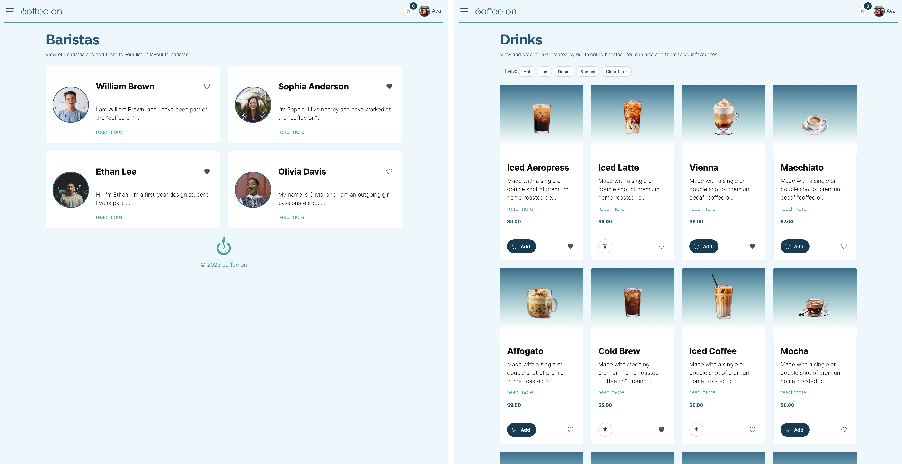

# digexmp1-a3-frontend

## Curtin University - Academic Integrity Warning

> "Curtin recognises that students who are unfamiliar with the conventions of academic writing can sometimes unintentionally plagiarise or collude on assessments. This may happen if you inadequately acknowledge resources or collaborate with other students when an assessment should be done individually. An academic integrity warning is used to assign you an educative action in these situations so you can learn from your mistakes. More serious academic breaches such as cheating are managed as misconduct."
For more information, visit [Academic Integrity at Curtin](https://www.curtin.edu.au/students/essentials/rights/academic-integrity/)

## 1. Links

- [Live website](https://endearing-manatee-fc92e7.netlify.app)
- ~~[Backend API](https://anyamchelo-coffeeon-backend-b2n2v.ondigitalocean.app)~~

## 2. Screenshots

#### 2.1. Log in and register pages

#### 2.2. Welcome page

#### 2.3. Home and cart pages

#### 2.4. Baristas and drinks pages

#### 2.5. Favourites

#### 2.6. Profile

